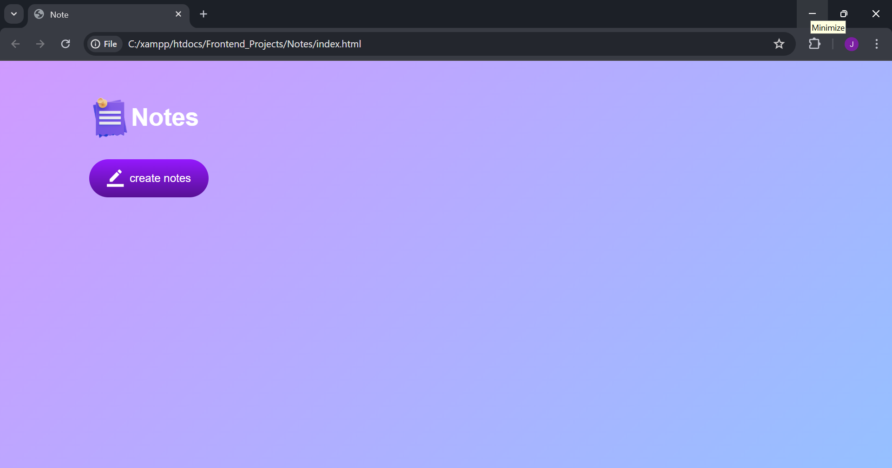
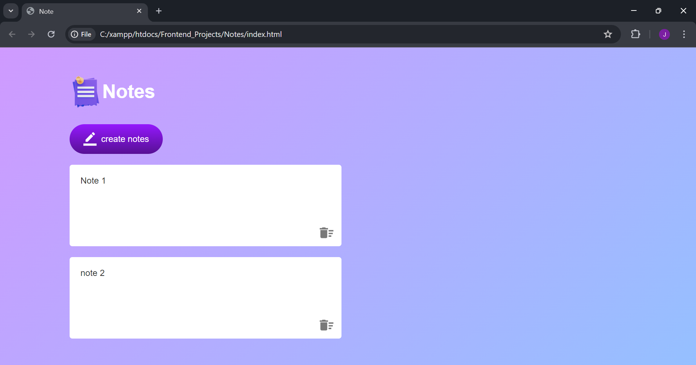
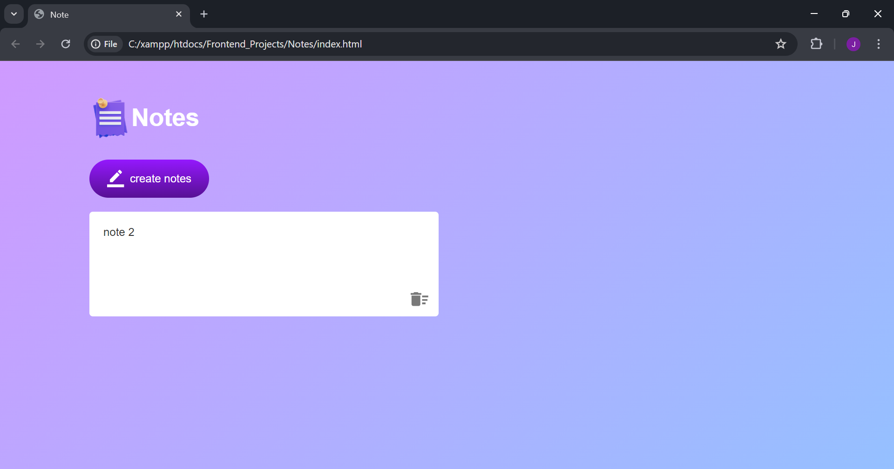

# Notes Website

A simple and user-friendly **Notes Website** built using HTML, CSS, and JavaScript. The website allows users to create, edit, and delete notes. Notes are automatically saved in the browser using Local Storage.

## Features
- Create new notes
- Edit notes
- Delete notes
- Save notes using Local Storage
- Notes remain available after refreshing the browser
- Simple and clean user interface

## Technologies Used
- HTML5
- CSS3
- JavaScript
- Local Storage

## How It Works
When the user clicks the Create Notes button, JavaScript dynamically creates an editable note. The notes are saved in the browser using Local Storage. 

```javascript
function updateStorage() {
    localStorage.setItem("notes", notesContainer.innerHTML);
}
```

When the website loads, the saved notes are retrieved using:

```javascript
function showNotes() {
    notesContainer.innerHTML = localStorage.getItem("notes");
}

showNotes();
```

## Screenshots  







## What I Learned
Through this project, practiced:
- DOM manipulation
- Event listeners
- Dynamic element creation
- Local Storage
- Keyboard events
- HTML and CSS styling
 
## Future Improvements
- Dark mode
- Search functionality
- Note categories
- Different note colors
- Date and time for notes
- Improved mobile responsiveness

 
